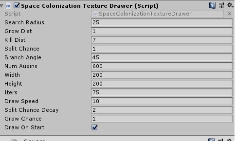
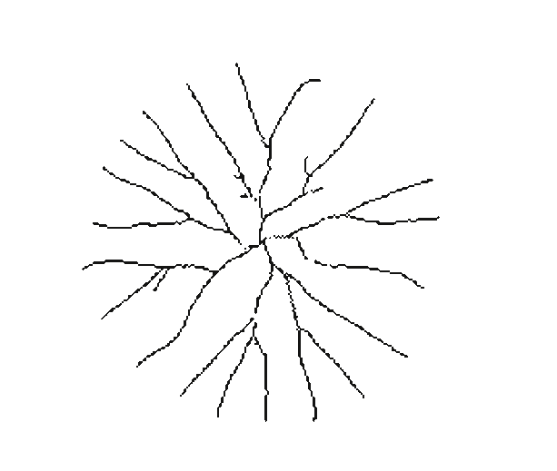
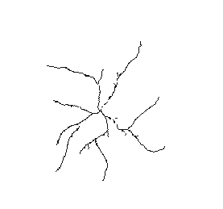
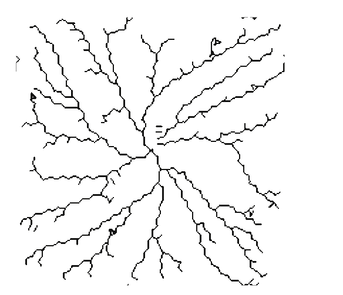
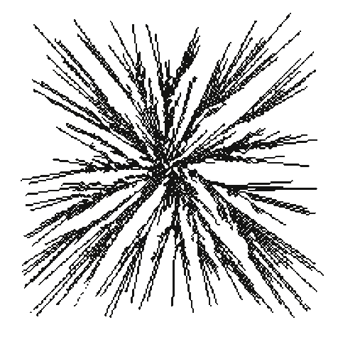
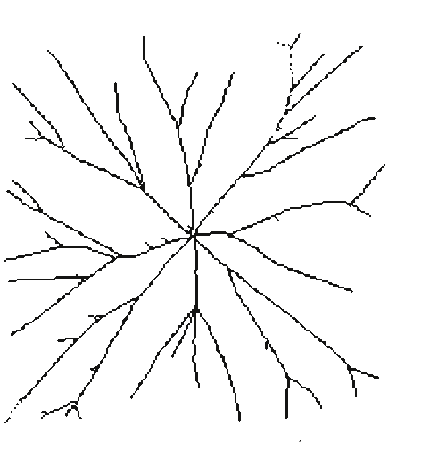

# Procedural Cracks Based on Space Colonization Algorithm

This project draws black lines on a transparent Unity3D quad from the center of
the crack outwards in real-time. It's fairly easy to modify and play with. For
instance, by adding a global bias node to every interation, you can create
cracks that grow in a single direction, which look quite a lot like bushes or
trees. By varing the provided settings you can provide a wide variety of
crack-like effects, some of which look like Lichtenberg figures and may be
useful for building procedural lighting.

Below is an example of the settings provided and a typical range of outputs
provided by varing those default settings.

## How to Use

Clone into the Assets folder of your Unity project. A prefab is provided which
should work out of the box. If not, drag "SpaceColonizationTextureDrawer" onto
a quad. Under the MeshRenderer, find or attach the material. Make sure the
material is set to "Cutout" rendering mode. The script is designed so that you
place a transparent quad on top of the object you want to form a crack and so
it needs a transparent material to draw on. However, it shouldn't be difficult
to modify to draw a crack on top of existing assets and textures.

Additionally, instead of creating a crack the second the script is started, the
public function "Generate" can be called on the component when needed instead.

## Algorithm Overview and Terminology

The Space Colonization algorithm was originally a simulation of vein/stem
growth inside of leafs. When a plant is growing a new leaf, the leaf cells
produce a hormon called "auxin" when it isn't getting enough nutrients. The
stem grows towards the direction of auxins. These stems provide nutrients, so
once the stem gets close to an area of cells, those cells stop producing auxin.
A stem also removes auxins from the nearby area. As a consequence, branches in
a stem grow towards auxins and away from from stems. Even though auxins aren't
really resources, it's as if the veins are competing witheachother for auxins.

In this project, "auxins" are Vector2s which attract veinNodes. Vein Nodes are
also Vector2s which represent the growing end of a vein. Other writers
sometimes call these "buds", imagining the growth of a tree rather than the
growth of a vein/stem in a leaf.

Suppose auxins a1, a2, and a3 all share the same vein node, v1, as their
nearest vein node. The set {a1, a2, a3} is said to be the "attractors" of v1.
This is NOT the same thing as saying that the closest auxins to v1 are a1, a2,
and a3. If a given auxin is the closest auxin to v1, but that auxin is even
closer to v2, then that auxin is transported away by v2 and might as well not
exist as far as v1 is concerned.

The Space Colonization Algorithm has been applied to the generation of cracks.
Unfortunately, I'm unable to find the paper that originally suggested this
anymore as I no longer have access to my school's database of papers. But the
justification is rather straight forward: materials have natural weak points in
them. When a force smacks down into a material, naturally the weakest spots
will shear and shatter first. When a crack appears in glass, it zigzages
outwards to invisible imperfections in the manufacture of the glass. This
cascading failure is like veins (cracks) growing towards auxins (weak points).

The only difference that must be accounted for is that cracks propogate
outwards in all directions (this is actually a simplificaiton of the original
algorithm) and that branching behavior is more likely at the origin than it is
farther away. Otherwise, this is a scientifically plausible model of crack
generation.

The actual algorithm is as follows:

1. Cover a (width x height) plane in n randomly positioned auxins, where n is
   the field *NumAuxins*.
2. For each auxin, calculate the nearest vein node, provided there is a vein
   node within *SearchRadius* distance of that auxin. This will result in a
   mapping where every vein node can map to many (or none) auxins, but where
   every auxin maps to either 0 or 1 vein node, simulating competition between
   nodes for auxins.
3. Grow each branch of the vein towards the center of all of that vein's
   attractors by a fixed amount, *GrowDist*.
4. For each branch, remove any auxins sufficiently close to a vein, where
   sufficiently close is called *KillDist*.
5. Split each branch with probability "SplitChance." Grow it a "GrowDist" away
   from the current vein at an angle, *BranchAngle*.
6. Repeat until there are no more auxins left or there have been *Iters*
   grow-kill-branch iterations completed.

## Code Walkthrough

### KDTree/KDTree.cs

The algorithm repeatedly queries points within a certain distance from another
point. A KDTree with nearest neighbor search is implemented for this purpose.
It's pretty standard stuff assuming you're already familiar tree-based
datastructures. The key difference between a KDTree and a Binary Search Tree is
that because you have k-dimensional points instead a single value to compare
each node against, you alternate between comparing the X dimension and the Y
dimension.

### SpaceColonization/Edge.cs

A pair of points, used to draw the stems/veins when its time to draw.

### SpaceColonization/SpaceColonization.cs

The heart of the project. Yields a set of edges representing vein/crack
segements.

### SpaceColonization/SpaceColonizationnTextureDrawer.cs

Calls the Space Colonization algorithm and draws its output onto a new texture.
You can think of the regular SpaceColonization.cs as the model and this
MonoBehaviour as a View-Controller.

### Tests/KDTreeTests.cs

Just some unit tests I used to write the KDTree.

### Tests/SpaceColonizationTests.cs

Just some unit tests I used to write the SpaceColonization script. Towards the
end, I spent more time testing by visually observing the results of the script
and so some late editions to the code might not have full coverage.
